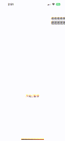

# swift简单弹幕例子，仿哔哩哔哩

每个弹幕的速度都是不一样的，支持弹幕整体开始暂停。
如果弹幕实在是太多了，有个缓冲队列，不停的重试能否显示，保证文字都能显示全，并且每条都能显示。




# 使用例子

```swift
override func viewDidLoad() {
    super.viewDidLoad()
	var danmuView: XDanMuView = XDanMuView()
	danmuView.frame = .init(x: 0, y: 100, width: self.view.frame.size.width, height: self.view.frame.size.height - 200)
	self.view.addSubview(danmuView)

	// 配置项
    danmuView.minSpeed = 1
    danmuView.maxSpeed = 2
    danmuView.gap = 20
    danmuView.lineHeight = 30

	// 启动弹幕
	danmuView.start()
	// 启动一个定时器灌弹幕
	timer = Timer.scheduledTimer(timeInterval: 0.4, target: self, selector: #selector(addDanMu), userInfo: nil, repeats: false)
}

@objc func addDanMu() {
    let interval = CGFloat.random(in: 0.3...1.0)
    Timer.scheduledTimer(timeInterval: interval, target: self, selector: #selector(addDanMu), userInfo: nil, repeats: false)
    
    var text = ""
    for _ in 0...Int.random(in: 1...30) {
        text += "嘿"
    }
    for _ in 0...Int.random(in: 1...2) {
        danmuView.addDanMu(text: text, isMe: Bool.random())
    }
}
```


